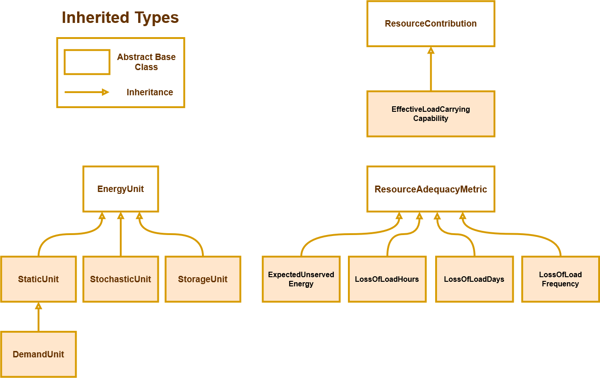

=========
Reference
=========

Motivation
----------
Understanding the resource adequacy of an energy system, or its ability to meet demand, is a critical task for researchers studying energy transition, cross-sectoral system evolution, and energy system operation.
Researchers in the Advancing Sustainable Systems through low-impact Energy Technologies (ASSET) Lab and in institutions globally need usable research-grade tools to quantify resource adequacy as part of their multi-dimensional studies. 
The ASSET lab resource adequacy package (assetra) seeks to meet this need, with the overarching goal to quantify the resource adequacy of energy systems while being flexible, extensible, and easy-to-use for energy researchers.

Interface Overview
------------------
The assetra object-oriented interface is shown in figure 1 and is best interpreted as a bottom-up model. 

*EnergyUnit* objects, such as demand centers and thermal generators, are added to the *EnergySystemBuilder*. 

The *EnergySystemBuilder* compiles energy units into *EnergySystem* objects (see [1]_ to understand the motivation for this distinction). 

*EnergySystem* objects are attached to *ProbabilisticSimulation* objects whose responsibility is to generate and store probabilistic net hourly capacity matrices for a large sample of Monte Carlo trials. The net hourly capacity matrix of a *ProbabilisticSimulation* is a two dimensional matrix representing net system capacity for each Monte Carlo iteration. 
The net hourly capacity matrix of a *ProbabilisticSimulation* is a two dimensional matrix representing net system capacity (demand minus capacity) for each Monte Carlo iteration.

*ProbabilisticSimulation* objects are attached to *ResourceAdequacyMetric* objects, who quantify resource adequacy, typically as a function of the net hourly capacity matrix.

In addition to resource adequacy, the assetra package quantifies resource contribution of additional resources to an energy system, specifically with effective load-carrying capability (ELCC) metric. Per definition, an *EffectiveLoadCarryingCapability* object computes the resource adequacy of a base *EnergySystem*, and then iteratively finds the constant load that can be served by additional resources at the same base resource adequacy level. Because the computation of resource adequacy depends on both the simulation parameters and the selected resource adequacy metric, the *EffectiveLoadCarryingCapability* object is composed of a base energy system, as well as a *ProbabilisticSimulation* object and *ResourceAdequacyMetric* type. 

.. figure:: _static/assetra-class-interface.drawio.png
   :scale: 50 %
   :alt: assetra class interface

   Figure 1: Class interface.

Several of the core types in the assetra model are defined as abstract base classes. Abstract interfaces allow for interchangeability and enable users to extend functionality, for example, by creating custom unit types and resource adequacy metrics without modifying the simulation framework. See the usage page for an example. Figure 2 shows the abstract base classes and their derived types. 

   Figure 2: Derived types used in the assetra model.

Assumptions
-----------

**Static Units**
 - Static units are instantiated with hourly capacity profiles.
 - Static units always contribute their full hourly capacity.
 - Demand profiles, instantiated as `DemandUnit` objects, are treated identically to static units but with a negative contribution.

**Stochastic Units**
 - Stochastic units are instantiated with hourly capacity profiles and hourly forced outage rates.
 - Stochastic unit outages are sampled independently in each hour.
 - Stochastic units contribute zero capacity in hours where unit outages occur, otherwise they contribute their full hourly capacity.
 - Stochastic units are well-suited to model thermal, solar, and wind generators.

**Storage Units**
 - Storage units are dispatched with a greedy policy to minimize expected unserved energy. When net capacity exceeds demand, storage units charge. When system demand exceeds capacity, storage units discharge. Both charging and discharing are limited by the rated power capacity of the unit.
 - Storage units are dispatched sequentially according to the order in which they are added to the system.
 - Storage unit efficiency deratings are applied in equal part on charge and discharge. 
 - Storage units are initialized with full state of charge.
 - Storage units are well-suited to model battery and pumped hydro storage [3]_.

**ProbabilisticSimulation**
 - Probabilistic simulations dispatch unit datasets in order of type. The established order is *DemandUnit*, *StaticUnit*, *StochasticUnit*, *StorageUnit* [2]_.

**Hydro Unit**
   (NOTE: only works for 12 months at a time right now) 
 - Hydro units borrow much from the stoachastic unit but are initated with monthly generation profiles.  
 - Hydro units are instantiated with hourly forced outage rates and nameplate capacities.
 - Hourly capacity profiles of Hydro units are calculated by the unit based on net demand of units listed before the Hydro unit in NONRESPONSIVE_UNIT_TYPES. 
 - Hydro unit outages are sampled independently in each hour.
 - Hydro units contribute zero capacity in hours where unit outages occur, otherwise they contribute their full hourly capacity.
 - Hydro units can be used to model individual hydropower plants or regional hydropower.
Notes
-----
.. [1] Internally, we **try** to think of *EnergySystem* objects as immutable. There is no method to directly add, remove, or modify *EnergyUnit* objects to/from/in an *EnergySystem*. The reason for this is to make explicitly clear to users that higher level objects do not track the state of lower-level objects. For example, if a user wants to modify a system for which a probabilistic simulation has already been evaluated, it would be tedious to both recognize the system modification from the simulation object and preserve computation from the existing evaluation. Further, we want to make efficient use of data structures for larger simulations. For example, it is both time- and memory- efficient to operate on whole fleets of energy units via matrix operation rather than evaluating each unit individually. This also offers a straightforward path to future parallelization. On the other hand, it is important for users to modify systems, i.e. add or remove units at will, and it is convenient to think of energy units as individual conceptual objects (not as fleets). To summarize, the internal energy system model should be immutable and operate on fleets of energy units, while the external model should be modifiable and treat energy units as individual objects. The *EnergySystemBuilder* acts as a bridge between these two models, by initializing the *EnergySystem* with a list of `xarray <https://docs.xarray.dev/en/stable/index.html>`_ datasets representing immutable fleets.
.. [2] The dispatch order of unit datasets in probabilistic simulations is defined by two variables in the *assetra.units* module, specifically *RESPONSIVE_UNIT_TYPES* and *NONRESPONSIVE_UNIT_TYPES*. These two variables are lists which both define valid energy unit types and distinguish the order of unit dispatch. The responsive/non-responsive nomenclature refers to whether the hourly capacity of units of a given type depend on system conditions. For example, *StaticUnit* and *StochasticUnit* qualify as non-responsive because their probabilistic hourly capacities do not depend on the net hourly capacity matrix. *StorageUnit* on the other hand qualifies as a responsive type. Dispatch order follows the combined list *(NONRESPONSIVE_UNIT_TYPES + RESPONSIVE_UNIT_TYPES)*.
.. [3] Conventional hydroelectric units are not well-modeled by the existing `assetra` unit types. Depending on the application, it may be acceptable to treat hydroelectric as either a `StaticUnit` or `StochasticUnit`. The most appropriate model would likely modify the `StorageUnit` implementation to replace charge cycles with hydrological constraints.

Modules
-------
.. toctree::
   :maxdepth: 3

   assetra.units
   assetra.system
   assetra.simulation
   assetra.metrics
   assetra.contribution
