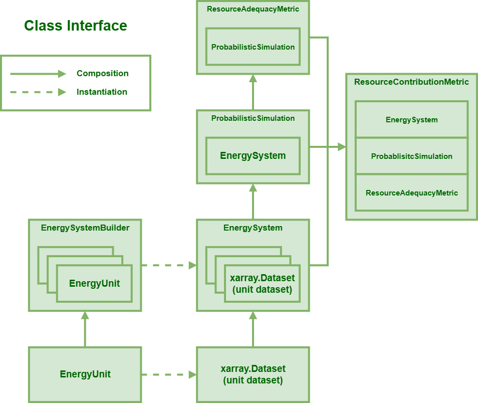

=========
Reference
=========

Motivation
----------
Understanding the resource adequacy of an energy system, or its ability to meet demand, is a critical task for researchers studying energy transition, cross-sectoral system evolution, and energy system operation.
Researchers in the Advancing Sustainable Systems through low-impact Energy Technologies (ASSET) Lab and in institutions globally need usable research-grade tools to quantify resource adequacy as part of their multi-dimensional studies. 
The ASSET lab resource adequacy package (assetra) seeks to meet this need, with the overarching goal to quantify the resource adequacy of energy systems while being flexible, extensible, and easy-to-use for energy researchers.

Interface Overview
------------------
The assetra interface is object-oriented and best interpreted as a bottom-up model: individual resources are collected into an energy system, the system is simulated probabilistically, 
and the simulation is summarized by one or more resource adequacy metrics. Figure 1 shows the full class interface.

*EnergyUnits* are the building blocks of an `assetra` model. Each *EnergyUnit* represents a resource with an hourly capacity profile — a demand center, a thermal generator, a wind farm, a battery. 
Units are added one at a time to an *EnergySystemBuilder*, which is responsible for managing them and assembling them into a system.

*EnergySystems* are produced by calling *build()* on the builder. The resulting *EnergySystem* is an immutable collection of unit fleets rather than of individual units (see [1]_ for the motivation behind this distinction). 

*ProbabilisticSimulations* are where the Monte Carlo sampling happens. A *ProbabilisticSimulation* is instantiated with a start hour, an end hour, and a trial size, and is then assigned an 
*EnergySystem*. Calling *run()* dispatches every unit in the system across every trial and populates the net hourly capacity matrix: a two dimensional matrix of net system capacity
for each Monte Carlo iteration and each hour of the study period.

*ResourceAdequacyMetrics* turn the net capacity matrix produced by the *ProbabilisticSimulation* into report values for your simulation horizon.
A *ResourceAdequacyMetric* is instantiated with a simulation object and evaluated with *evaluate()*. *ResourceAdequacyMetric* itself is an abstract base class; in practice users work with one of its concrete implementations:

.. list-table::
   :header-rows: 1
   :widths: 30 70
 
   * - Metric
     - Quantifies
   * - *ExpectedUnservedEnergy*
     - Total energy not served over the study horizon.
   * - *LossOfLoadHours*
     - Expected number of hours with a shortfall over the study horizon.
   * - *LossOfLoadDays*
     - Expected number of days with at least one shortfall hour over the study horizon.
   * - *LossOfLoadFrequency*
     - Expected number of distinct shortfall events over the study horizon. 

In addition to resource adequacy, the assetra package quantifies resource contribution of additional resources to an energy system, specifically with effective load-carrying capability (ELCC) metric. Per definition, an *EffectiveLoadCarryingCapability* object computes the resource adequacy of a base *EnergySystem*, and then iteratively finds the constant load that can be served by additional resources at the same base resource adequacy level. Because the computation of resource adequacy depends on both the simulation parameters and the selected resource adequacy metric, the *EffectiveLoadCarryingCapability* object is composed of a base energy system, as well as a *ProbabilisticSimulation* object and *ResourceAdequacyMetric* type. 

   Figure 1: Class interface.

Several core types in assetra are abstract base classes. Abstract interfaces allow for interchangeability and let users extend functionality — creating custom unit types or resource adequacy metrics 
without modifying the simulation framework. Figure 2 shows the abstract base classes and their derived types.

.. figure:: _static/assetra-inherited-types.drawio.png
   :scale: 50 %
   :alt: assetra derived types

   Figure 2: Derived types used in the assetra model.

Basic Workflow
--------------
A typical assetra study proceeds in two stages.
 
**Stage 1: Build the energy system**
 
1. Instantiate an *EnergySystemBuilder*.
2. Add a *DemandUnit* carrying the hourly demand profile for the system.
3. Add generating and storage capacity, choosing the unit type that matches each resource (see the table below).
4. Call *build()* to produce an *EnergySystem*.
 
**Stage 2: Simulate and evaluate**
 
1. Instantiate a *ProbabilisticSimulation* with a start hour, end hour, and Monte Carlo trial size.
2. Assign the energy system with *assign_energy_system()*.
3. Call *run()* to populate the net hourly capacity matrix.
4. Instantiate a resource adequacy metric with the simulation and call *evaluate()*.
 
Optionally, pass a base system, a simulation, and a metric type to an *EffectiveLoadCarryingCapability* object to quantify the contribution of additional resources.

Choosing an Energy Unit Type
----------------------------
.. list-table::
   :header-rows: 1
   :widths: 22 48 30
 
   * - Unit type
     - Use for
     - Instantiated with
   * - *DemandUnit*
     - System demand. Treated identically to a static unit, but contributing negatively.
     - Hourly demand profile
   * - *StaticUnit*
     - Resources that always contribute their full profile, with no outage sampling.
     - Hourly capacity profile
   * - *HydroUnit*
     - Conventional hydro, either plant-level or aggregated regional hydro.
     - Monthly generation totals, nameplate capacity, hourly forced outage rates
   * - *StochasticUnit*
     - Thermal, solar, and wind generators subject to forced outages.
     - Hourly capacity profile, hourly forced outage rates
   * - *StorageUnit*
     - Battery and pumped hydro storage, dispatched with a greedy policy.
     - Charge/discharge capacity, energy capacity, efficiency

Preparing Input Data
--------------------
Energy units accept hourly profiles as `xarray <https://docs.xarray.dev/en/stable/index.html>`_ *DataArray* objects with a single :code:`time` dimension and datetime coordinates. 
This applies to every profile passed to a unit, including hourly capacity, hourly demand, and hourly forced outage rates. All units in a system must share a common time index, and the
simulation period requested from a *ProbabilisticSimulation* must fall within it. This may require some "data wrangling" in pre-processing as forced outage rates drawn from vulnerability curves
and demand data from utilities are unlikely to have matching time indices. The *assetra.utils* module provides a helper function to construct a time-indexed *DataArray* from a sequence of hourly values, 
which is useful for preparing input data coming from variety of sources.

Where a dataset already carries its own timestamps, it is usually clearest to construct the *DataArray* directly, so that the coordinates come from the source data rather than being assumed. 
The :code:`assetra.utils` module provides a shortcut for the other common case, in which the data is a plain sequence of hourly values with no index attached:

.. code-block:: python

   from assetra.utils import get_hourly_time_series_xr

   hourly_demand = get_hourly_time_series_xr(
       [100.0] * 8760, start_hour="2019-01-01 00:00:00"
   )

The values are assumed to be consecutive and evenly spaced at one-hour intervals, with the first value corresponding to :code:`start_hour`. 
The length of the input determines the length of the resulting time index, so a full non-leap year of hourly data is 8760 values. This helper is a convenience for formatting input data and is not part 
of the resource adequacy model. Units are indifferent to how their profiles were constructed, provided the dimension and coordinates are correct.

Dispatch Order
--------------
Units are not dispatched in the order they are added to the builder. They are dispatched by type, in a fixed order defined by the *RESPONSIVE_UNIT_TYPES* and *NONRESPONSIVE_UNIT_TYPES* variables 
in the *assetra.units* module [2]_. This order can be edited by declaring new lists with the desired order for your specific use case. 
The distinction is whether a unit's hourly capacity depends on full system conditions: responsive units dispatch last and alter output based on the net hourly capacity matrix.
 
The effective order is:
 
1. *DemandUnit* (non-responsive)
2. *StaticUnit* (non-responsive)
3. *HydroUnit* (non-responsive)
4. *StochasticUnit* (non-responsive)
5. *StorageUnit* (responsive)
 
The two units that are most impacted by dispatch order are the *HydroUnit* and *StorageUnit*. The *StorageUnit* is dispatched last, after every other unit type and both charges and discharges based on the net hourly capacity matrix. 
The *HydroUnit* is considered non-responsive, as it does not charge and discharge like the *StorageUnit*. However, hourly dispatch of the *HydroUnit* is dependent on the net demand in the system after the units 
preceding it in the *NONRESPONSIVE_UNIT_TYPES* list have been dispatched. The monthly generation profile for the *HydroUnit* is converted into an hourly capacity profile by distributing the 
monthly total across each hour of the month proportional to the net demand remaining after the generation from units listed before the Hydro Unit in NONRESPONSIVE_UNIT_TYPES are considered. 

Assumptions
-----------

**Static Units**
 - Static units are instantiated with hourly capacity profiles.
 - Static units always contribute their full hourly capacity.
 - Demand profiles, instantiated as `DemandUnit` objects, are treated identically to static units but with a negative contribution.

**Stochastic Units**
 - Stochastic units are instantiated with hourly capacity profiles and hourly forced outage rates.
 - Stochastic unit outages are sampled independently in each hour.
 - Stochastic units contribute zero capacity in hours where unit outages occur, otherwise they contribute their full hourly capacity.
 - Stochastic units are well-suited to model thermal, solar, and wind generators.

**Storage Units**
 - Storage units are dispatched with a greedy policy to minimize expected unserved energy. When net capacity exceeds demand, storage units charge. When system demand exceeds capacity, storage units discharge. Both charging and discharging are limited by the rated power capacity of the unit.
 - Storage units are dispatched sequentially according to the order in which they are added to the system.
 - Storage unit efficiency deratings are applied in equal part on charge and discharge. 
 - Storage units are initialized with full state of charge unless initial soc is set lower. 
 - Storage units are well-suited to model battery and pumped hydro storage [3]_.

**ProbabilisticSimulation**
 - Probabilistic simulations dispatch unit datasets in order of type. The established order is *DemandUnit*, *StaticUnit*, *StochasticUnit*, *StorageUnit* [2]_.

**Hydro Unit**
   (NOTE: only works for 12 months at a time right now, cannot run for longer time blocks)  
 - Hydro units borrow much from the stochastic unit but are initiated with monthly generation estimates.
 - Monthly generation profiles are intended to be an estimate of total generation for a unit in every month of a 12 month cycle, based on EIA annual collection of  monthly generation reports from operational hydropower units. 
 - The Hydro Unit turns the monthly generation profile into an hourly capacity profile by distributing the monthly total across each hour of the month proportional to the net demand remaining after the generation from units listed before the Hydro Unit in NONRESPONSIVE_UNIT_TYPES are considered.   
 - Hydro units are instantiated with hourly forced outage rates and nameplate capacities, and the net-demand-proportional capacity in each hour is limited by the nameplate capacity of the unit. 
 - Hydro unit outages are sampled independently in each hour.
 - Hydro units contribute zero capacity in hours where unit outages occur, otherwise they contribute their full hourly capacity as calculated from the proportional assignment of the monthly generation across all hours of the month.
 - Hydro units can be used to model individual hydropower plants or regional hydropower. For larger systems, modeling a single regional hydropower unit that accounts for all generation potential in the area will significantly reduce program run time as opposed to modeling every generator separately. 

Notes
-----
.. [1] Internally, we **try** to think of *EnergySystem* objects as immutable. There is no method to directly add, remove, or modify *EnergyUnit* objects to/from/in an *EnergySystem*. The reason for this is to make explicitly clear to users that higher level objects do not track the state of lower-level objects. For example, if a user wants to modify a system for which a probabilistic simulation has already been evaluated, it would be tedious to both recognize the system modification from the simulation object and preserve computation from the existing evaluation. Further, we want to make efficient use of data structures for larger simulations. For example, it is both time- and memory- efficient to operate on whole fleets of energy units via matrix operation rather than evaluating each unit individually. This also offers a straightforward path to future parallelization. On the other hand, it is important for users to modify systems, i.e. add or remove units at will, and it is convenient to think of energy units as individual conceptual objects (not as fleets). To summarize, the internal energy system model should be immutable and operate on fleets of energy units, while the external model should be modifiable and treat energy units as individual objects. The *EnergySystemBuilder* acts as a bridge between these two models, by initializing the *EnergySystem* with a list of `xarray <https://docs.xarray.dev/en/stable/index.html>`_ datasets representing immutable fleets.
.. [2] The dispatch order of unit datasets in probabilistic simulations is defined by two variables in the *assetra.units* module, specifically *RESPONSIVE_UNIT_TYPES* and *NONRESPONSIVE_UNIT_TYPES*. These two variables are lists which both define valid energy unit types and distinguish the order of unit dispatch. The responsive/non-responsive nomenclature refers to whether the hourly capacity of units of a given type depend on system conditions. For example, *StaticUnit* and *StochasticUnit* qualify as non-responsive because their probabilistic hourly capacities do not depend on the net hourly capacity matrix. *StorageUnit* on the other hand qualifies as a responsive type. Dispatch order follows the combined list *(NONRESPONSIVE_UNIT_TYPES + RESPONSIVE_UNIT_TYPES)*.
.. [3] Partial outages instead of full outages can be achieved by varying the hourly capacity factor of a generation unit. This functionality is specifically useful for wind and solar farms that may operate at only 25-50% capacity during certain time periods. 

